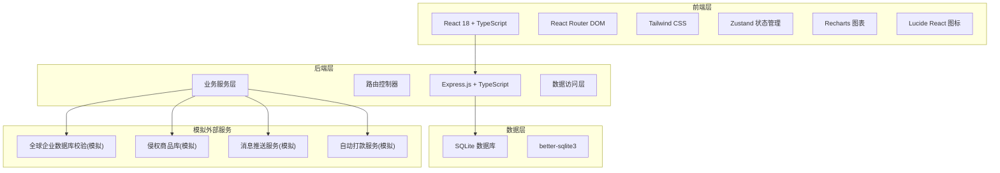
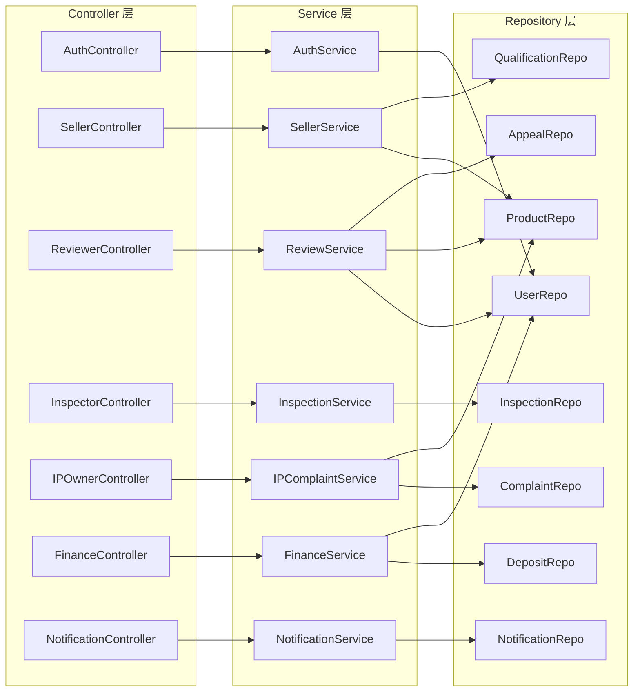
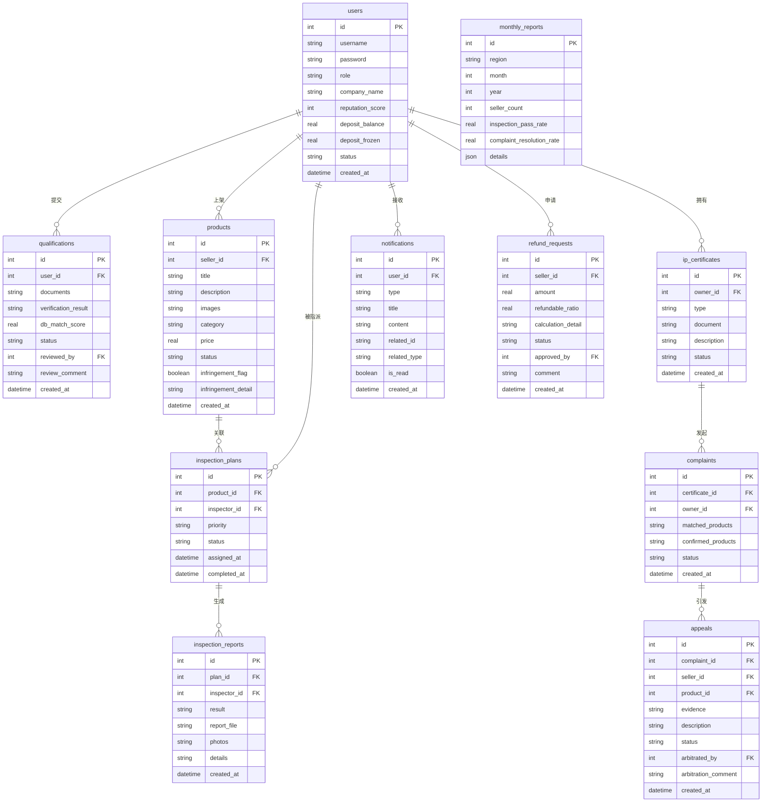

## 1. 架构设计



## 2. 技术说明

- **前端**: React@18 + TailwindCSS@3 + Vite
- **初始化工具**: vite-init
- **后端**: Express@4 + TypeScript (ESM)
- **数据库**: SQLite (better-sqlite3)，使用 Mock 数据填充
- **状态管理**: Zustand
- **路由**: React Router DOM v6
- **图表**: Recharts
- **图标**: Lucide React

## 3. 路由定义

| 路由 | 用途 |
|------|------|
| `/login` | 统一登录页，角色选择与登录 |
| `/seller` | 卖家工作台 - 仪表盘概览 |
| `/seller/qualification` | 卖家工作台 - 资质管理 |
| `/seller/products` | 卖家工作台 - 商品管理 |
| `/seller/appeals` | 卖家工作台 - 申诉中心 |
| `/seller/deposit` | 卖家工作台 - 保证金管理 |
| `/reviewer` | 审核员工作台 - 仪表盘概览 |
| `/reviewer/qualification-review` | 审核员工作台 - 资质审核 |
| `/reviewer/infringement-review` | 审核员工作台 - 侵权复审 |
| `/reviewer/appeal-arbitration` | 审核员工作台 - 申诉仲裁 |
| `/inspector` | 质检机构工作台 - 仪表盘概览 |
| `/inspector/tasks` | 质检机构工作台 - 抽检任务 |
| `/inspector/reports` | 质检机构工作台 - 报告上传/历史 |
| `/ip-owner` | 知识产权权利人工作台 - 仪表盘概览 |
| `/ip-owner/certificates` | 知识产权权利人工作台 - 权利证明管理 |
| `/ip-owner/complaints` | 知识产权权利人工作台 - 发起投诉 |
| `/ip-owner/complaint-tracking` | 知识产权权利人工作台 - 投诉进展 |
| `/finance` | 财务工作台 - 仪表盘概览 |
| `/finance/refund-approval` | 财务工作台 - 退还审批 |
| `/finance/reports` | 财务工作台 - 运营报表 |
| `/notifications` | 消息通知中心 |

## 4. API 定义

### 4.1 认证相关

```typescript
POST   /api/auth/login          { username, password, role } => { token, user }
POST   /api/auth/register       { username, password, role, companyInfo } => { token, user }
GET    /api/auth/me             => { user }
```

### 4.2 卖家相关

```typescript
GET    /api/sellers/profile                     => SellerProfile
POST   /api/sellers/qualification               { documents } => QualificationResult
GET    /api/sellers/qualification/status         => QualificationStatus
GET    /api/sellers/products                    => Product[]
POST   /api/sellers/products                    { title, description, images, category, price } => Product
GET    /api/sellers/products/:id                => Product
POST   /api/sellers/appeals                     { productId, evidence, description } => Appeal
GET    /api/sellers/appeals                     => Appeal[]
POST   /api/sellers/deposit/refund              { amount } => RefundRequest
GET    /api/sellers/deposit                     => DepositInfo
```

### 4.3 审核员相关

```typescript
GET    /api/reviewer/qualification-queue        => QualificationReview[]
POST   /api/reviewer/qualification/:id/review   { approved, comment } => ReviewResult
GET    /api/reviewer/infringement-queue          => InfringementReview[]
POST   /api/reviewer/infringement/:id/review    { action, comment } => ReviewResult
GET    /api/reviewer/appeal-queue                => AppealReview[]
POST   /api/reviewer/appeal/:id/arbitrate       { upheld, comment } => ArbitrationResult
```

### 4.4 质检机构相关

```typescript
GET    /api/inspector/tasks                      => InspectionTask[]
GET    /api/inspector/tasks/:id                  => InspectionTask
POST   /api/inspector/tasks/:id/report           { result, report, photos } => InspectionReport
GET    /api/inspector/history                    => InspectionReport[]
```

### 4.5 知识产权权利人相关

```typescript
GET    /api/ip/certificates                      => Certificate[]
POST   /api/ip/certificates                      { type, document, description } => Certificate
POST   /api/ip/complaints                        { certificateId, matchedProducts } => Complaint
GET    /api/ip/complaints/match                   { certificateId } => MatchedProduct[]
GET    /api/ip/complaints                        => Complaint[]
POST   /api/ip/complaints/:id/confirm            { confirmedProductIds } => Complaint
```

### 4.6 财务相关

```typescript
GET    /api/finance/refund-requests              => RefundRequest[]
POST   /api/finance/refund-requests/:id/approve  { approved, comment } => ApprovalResult
GET    /api/finance/reports/monthly               { month, year } => MonthlyReport
GET    /api/finance/reports/regional              => RegionalReport[]
```

### 4.7 通知相关

```typescript
GET    /api/notifications                        { type?, unread? } => Notification[]
PUT    /api/notifications/:id/read               => void
GET    /api/notifications/unread-count           => { count }
```

## 5. 服务端架构图



## 6. 数据模型

### 6.1 数据模型定义



### 6.2 数据定义语言

```sql
CREATE TABLE users (
    id INTEGER PRIMARY KEY AUTOINCREMENT,
    username TEXT NOT NULL UNIQUE,
    password TEXT NOT NULL,
    role TEXT NOT NULL CHECK(role IN ('seller', 'reviewer', 'inspector', 'ip_owner', 'finance')),
    company_name TEXT,
    reputation_score INTEGER DEFAULT 100,
    deposit_balance REAL DEFAULT 0,
    deposit_frozen REAL DEFAULT 0,
    status TEXT DEFAULT 'active' CHECK(status IN ('active', 'suspended', 'banned')),
    region TEXT,
    created_at DATETIME DEFAULT CURRENT_TIMESTAMP
);

CREATE TABLE qualifications (
    id INTEGER PRIMARY KEY AUTOINCREMENT,
    user_id INTEGER NOT NULL REFERENCES users(id),
    documents TEXT NOT NULL,
    verification_result TEXT,
    db_match_score REAL,
    status TEXT DEFAULT 'pending' CHECK(status IN ('pending', 'auto_verified', 'manual_review', 'approved', 'rejected')),
    reviewed_by INTEGER REFERENCES users(id),
    review_comment TEXT,
    created_at DATETIME DEFAULT CURRENT_TIMESTAMP
);

CREATE TABLE products (
    id INTEGER PRIMARY KEY AUTOINCREMENT,
    seller_id INTEGER NOT NULL REFERENCES users(id),
    title TEXT NOT NULL,
    description TEXT,
    images TEXT,
    category TEXT NOT NULL,
    price REAL NOT NULL,
    status TEXT DEFAULT 'normal' CHECK(status IN ('normal', 'warning', 'locked', 'delisted')),
    infringement_flag INTEGER DEFAULT 0,
    infringement_detail TEXT,
    complaint_rate REAL DEFAULT 0,
    created_at DATETIME DEFAULT CURRENT_TIMESTAMP
);

CREATE TABLE inspection_plans (
    id INTEGER PRIMARY KEY AUTOINCREMENT,
    product_id INTEGER NOT NULL REFERENCES products(id),
    inspector_id INTEGER REFERENCES users(id),
    priority TEXT DEFAULT 'normal' CHECK(priority IN ('low', 'normal', 'high')),
    status TEXT DEFAULT 'pending' CHECK(status IN ('pending', 'assigned', 'sampling', 'completed')),
    assigned_at DATETIME,
    completed_at DATETIME,
    created_at DATETIME DEFAULT CURRENT_TIMESTAMP
);

CREATE TABLE inspection_reports (
    id INTEGER PRIMARY KEY AUTOINCREMENT,
    plan_id INTEGER NOT NULL REFERENCES inspection_plans(id),
    inspector_id INTEGER NOT NULL REFERENCES users(id),
    result TEXT NOT NULL CHECK(result IN ('qualified', 'warning', 'unqualified')),
    report_file TEXT,
    photos TEXT,
    details TEXT,
    created_at DATETIME DEFAULT CURRENT_TIMESTAMP
);

CREATE TABLE ip_certificates (
    id INTEGER PRIMARY KEY AUTOINCREMENT,
    owner_id INTEGER NOT NULL REFERENCES users(id),
    type TEXT NOT NULL CHECK(type IN ('trademark', 'patent', 'copyright')),
    document TEXT NOT NULL,
    description TEXT,
    status TEXT DEFAULT 'active' CHECK(status IN ('active', 'expired', 'revoked')),
    created_at DATETIME DEFAULT CURRENT_TIMESTAMP
);

CREATE TABLE complaints (
    id INTEGER PRIMARY KEY AUTOINCREMENT,
    certificate_id INTEGER NOT NULL REFERENCES ip_certificates(id),
    owner_id INTEGER NOT NULL REFERENCES users(id),
    matched_products TEXT,
    confirmed_products TEXT,
    status TEXT DEFAULT 'pending' CHECK(status IN ('pending', 'confirmed', 'notice_sent', 'appealed', 'resolved', 'dismissed')),
    created_at DATETIME DEFAULT CURRENT_TIMESTAMP
);

CREATE TABLE appeals (
    id INTEGER PRIMARY KEY AUTOINCREMENT,
    complaint_id INTEGER NOT NULL REFERENCES complaints(id),
    seller_id INTEGER NOT NULL REFERENCES users(id),
    product_id INTEGER NOT NULL REFERENCES products(id),
    evidence TEXT,
    description TEXT,
    status TEXT DEFAULT 'pending' CHECK(status IN ('pending', 'under_review', 'upheld', 'rejected')),
    arbitrated_by INTEGER REFERENCES users(id),
    arbitration_comment TEXT,
    created_at DATETIME DEFAULT CURRENT_TIMESTAMP
);

CREATE TABLE notifications (
    id INTEGER PRIMARY KEY AUTOINCREMENT,
    user_id INTEGER NOT NULL REFERENCES users(id),
    type TEXT NOT NULL CHECK(type IN ('review', 'inspection', 'complaint', 'appeal', 'refund')),
    title TEXT NOT NULL,
    content TEXT,
    related_id INTEGER,
    related_type TEXT,
    is_read INTEGER DEFAULT 0,
    created_at DATETIME DEFAULT CURRENT_TIMESTAMP
);

CREATE TABLE refund_requests (
    id INTEGER PRIMARY KEY AUTOINCREMENT,
    seller_id INTEGER NOT NULL REFERENCES users(id),
    amount REAL NOT NULL,
    refundable_ratio REAL NOT NULL,
    calculation_detail TEXT,
    status TEXT DEFAULT 'pending' CHECK(status IN ('pending', 'approved', 'rejected', 'completed')),
    approved_by INTEGER REFERENCES users(id),
    comment TEXT,
    created_at DATETIME DEFAULT CURRENT_TIMESTAMP
);

CREATE TABLE monthly_reports (
    id INTEGER PRIMARY KEY AUTOINCREMENT,
    region TEXT NOT NULL,
    month INTEGER NOT NULL,
    year INTEGER NOT NULL,
    seller_count INTEGER DEFAULT 0,
    inspection_pass_rate REAL DEFAULT 0,
    complaint_resolution_rate REAL DEFAULT 0,
    details TEXT,
    PRIMARY KEY (region, month, year)
);
```
